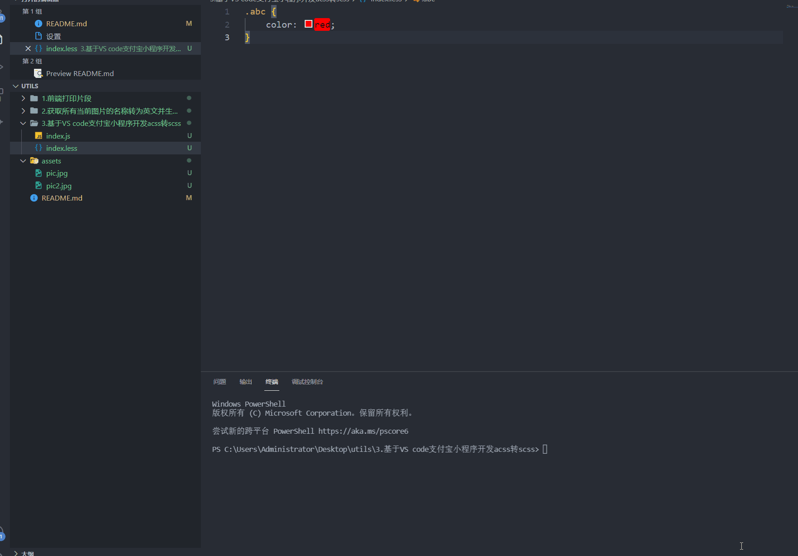
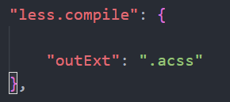

### 工作日常撸一撸，工具库

> 2021/12/29
解决在vs code中开发支付宝小程序写样式很麻烦的问题。
方案一：
1. 不得不说这个acss真的很难写，又不支持嵌套，开发效率很低；
2. 于是想到了借助node来实现自动化编译；
3. 首先vs code需要安装easyless插件（这个自动将less编译为css，样式可以直接写在less文件里，因为支持嵌套写起来很方便）；
4. 然后这个时候把index.js放在当前页面文件夹下，并执行
  `
  node index.js
  `
5. 这个时候index.js会监听当前目录下的less，并自动赋值css文件并生成一个acss文件；

方案二：
>其实不用那么麻烦，既然装了easyless文件，咋们改里面的配置文件就行了；

-----------------------------------------------

##### 2021/6/9
* 今天干工的时候，从蓝湖下载切图，发现都是中文的png文件，一方面我要使用中文名标注，另一方面在项目中坑定不能出现中文命名的图片吧。如果采用传统的手打那应该有点类的。 记得大学老师说的一句话，程序员都是懒的。 于是决定撸一撸
+ 获取当前文件夹所有文件名称，并生成文件名以及拼音文件，并将所有文件修改成拼音；
+ getAllFileAndRename 
  1. 将index.js 和 convetToPinyin.js
  2. 使用如下命令
`
        node index.js 
`
  3. 会生成list.js文件（里面包含原文件名，以及更改之后的文件名）；
  4. 此时原文件名被新的文件替换
------------------------------------------
##### 2021/5/20
### printpart.js 
#### 打印页面中具体的某一个片段

